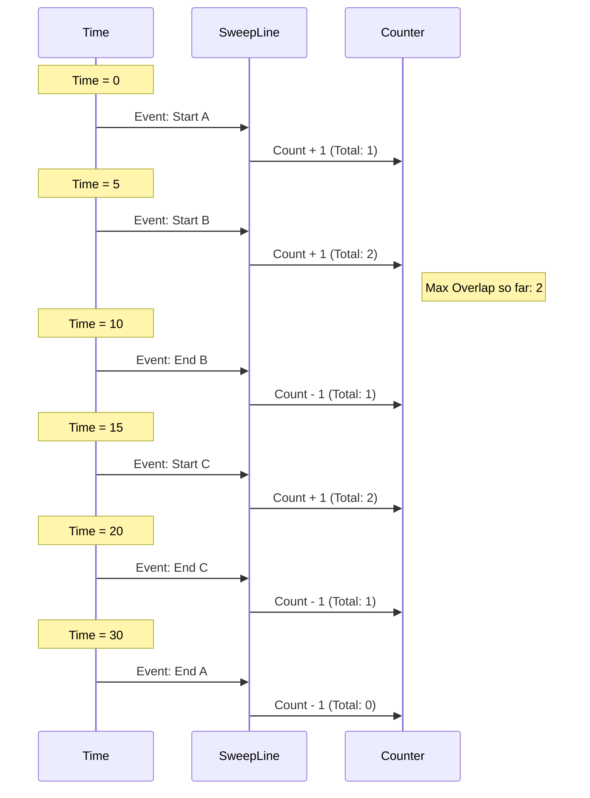

# Line Sweep Algorithm Explained

The **Line Sweep Algorithm** is a powerful technique used in computational geometry and interval problems. Imagine a vertical line sweeping across a plane from left to right (or top to bottom). As this line moves, we process "events" at specific coordinates.

This approach turns a 2D static problem into a dynamic 1D problem, often reducing time complexity from $O(N^2)$ to $O(N \log N)$.

## Core Concepts

1.  **Events**: These are the points of interest where the state of our sweep line changes. For interval problems, events are usually the *start* and *end* points of intervals.
2.  **Sweep Line**: An imaginary line representing the current position being processed.
3.  **Active Set (State)**: A data structure that maintains the state of objects currently intersecting the sweep line.

---

## Visualizing with Mermaid

Let's visualize the "Meeting Rooms" problem. We have several meetings with start and end times. We want to know the maximum number of rooms needed (maximum overlapping intervals).

### The Intervals

Imagine 3 meetings:
1.  Meeting A: [0, 30]
2.  Meeting B: [5, 10]
3.  Meeting C: [15, 20]

```mermaid
gantt
    title Meeting Intervals
    dateFormat X
    axisFormat %s
    
    section Room 1
    Meeting A (0-30)      :a1, 0, 30
    section Room 2
    Meeting B (5-10)      :a2, 5, 10
    Meeting C (15-20)     :a3, 15, 20
```



### The Sweep Process

We decompose these intervals into **Events**.
*   **Start Event (+1)**: A meeting starts. We need a room.
*   **End Event (-1)**: A meeting ends. We free up a room.

We sort these events by time. If times are equal, usually processing the "End" event first is better (to free up the room before taking a new one), depending on problem constraints (inclusive vs exclusive).



---

## C++ Implementation

Here is a standard template for solving interval overlap problems using Line Sweep.

### Problem: Maximum Overlapping Intervals

```cpp
#include <iostream>
#include <vector>
#include <algorithm>

using namespace std;

// Structure to represent an Event
struct Event {
    int time;
    int type; // +1 for start, -1 for end

    // Custom comparator for sorting
    bool operator<(const Event& other) const {
        if (time == other.time) {
            // If times are same, process END (-1) before START (+1)
            // to minimize overlap if boundaries are exclusive.
            // If boundaries are inclusive, process START before END.
            return type < other.type; 
        }
        return time < other.time;
    }
};

int maxOverlap(vector<pair<int, int>>& intervals) {
    vector<Event> events;

    // 1. Decompose intervals into events
    for (auto& interval : intervals) {
        events.push_back({interval.first, 1});  // Start of interval
        events.push_back({interval.second, -1}); // End of interval
    }

    // 2. Sort events
    sort(events.begin(), events.end());

    // 3. Sweep
    int max_rooms = 0;
    int current_rooms = 0;

    for (const auto& e : events) {
        current_rooms += e.type;
        max_rooms = max(max_rooms, current_rooms);
        
        cout << "Time: " << e.time 
             << " | Type: " << (e.type == 1 ? "Start" : "End") 
             << " | Current Overlap: " << current_rooms << endl;
    }

    return max_rooms;
}

int main() {
    // Example: {0, 30}, {5, 10}, {15, 20}
    vector<pair<int, int>> meetings = {{0, 30}, {5, 10}, {15, 20}};
    
    cout << "Maximum overlapping meetings: " << maxOverlap(meetings) << endl;
    
    return 0;
}
```

### Explanation of Code

1.  **Event Struct**: We flatten the 2D intervals `[start, end]` into 1D points. Each point carries a "type" (adding or removing).
2.  **Sorting**: This is the most crucial step. We sort by time. The order determines the movement of the sweep line.
    *   *Complexity*: $O(N \log N)$ due to sorting.
3.  **Sweeping**: We iterate through the sorted events.
    *   `current_rooms` acts as our state counter.
    *   We update `max_rooms` at every step.
    *   *Complexity*: $O(N)$ for the linear scan.

## General Algorithm Template

For more complex problems (like Skyline problem or Area of Union of Rectangles), the "State" is more complex than a simple integer counter. We often use a **Segment Tree** or a **Balanced Binary Search Tree (std::map / std::set)** as the active set.

```cpp
// Pseudo-code for generic Line Sweep
void lineSweep(vector<Object> objects) {
    vector<Event> events = createEvents(objects);
    sort(events.begin(), events.end());

    DataStructure activeSet; // e.g., std::set, Segment Tree

    for (auto& event : events) {
        // Process the event
        if (event.type == START) {
            activeSet.insert(event.id);
        } else {
            activeSet.remove(event.id);
        }

        // Query the active set for the answer at this specific x-coordinate
        updateResult(activeSet);
    }
}
```

## Summary

| Feature | Description |
| :--- | :--- |
| **Concept** | Process boundaries (events) in sorted order. |
| **Data Structure** | Often a simple counter, Heap, BST (`std::set`), or Segment Tree. |
| **Time Complexity** | Dominated by sorting: $O(N \log N)$. |
| **Space Complexity** | $O(N)$ to store events. |
| **Use Cases** | Interval overlaps, Skyline problem, Closest pair of points, Rectangle union area. |
